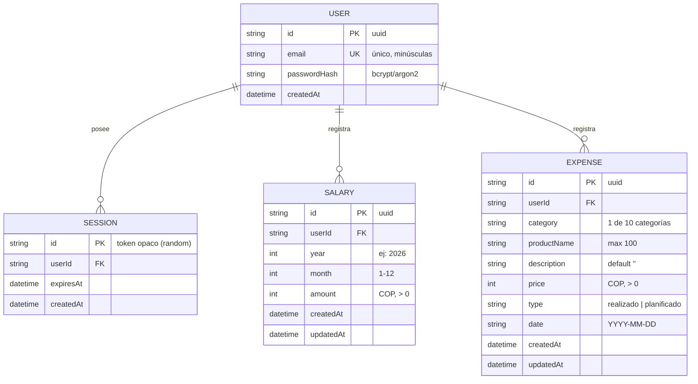

# Modelo de Datos — Finanzas App

> Versión 1.0 — 2026-09-25
> Motor destino: **SQLite** (vía Prisma). Todos los montos son enteros en COP.

## 1. Diagrama Entidad-Relación

> El diagrama se visualiza renderizado en GitHub, VS Code (extensión Mermaid) o
> cualquier visor compatible con Markdown + Mermaid.

## 2. Restricciones e índices

| Entidad | Restricción / índice | Motivo |
|---|---|---|
| `User` | `UNIQUE(email)` | Un usuario por correo |
| `Salary` | `UNIQUE(userId, year, month)` | RF-05: un solo sueldo por mes y usuario |
| `Expense` | `INDEX(userId, date)` | Los listados siempre filtran por usuario + rango de fechas del mes |
| `Expense` | `CHECK(type IN ('realizado','planificado'))` | Integridad del tipo (aplicado vía Prisma enum o validación) |
| `Session` | `INDEX(userId)` | Cierre de sesión y limpieza de sesiones de un usuario |
| Todas las FK | `ON DELETE CASCADE` | Borrar usuario borra sus datos (privacidad) |

## 3. Decisiones de modelado (y por qué)

1. **`Expense.date` es string `"YYYY-MM-DD"`, no timestamp.**
   Un gasto pertenece a un *día calendario*, sin hora ni zona horaria. Guardarlo
   como texto evita los bugs clásicos de UTC que "mueven" un gasto al día/mes
   anterior. El mes del gasto se deriva con `date.slice(0, 7)`.

2. **`Salary` usa `(year, month)` explícitos.**
   El sueldo es un dato *mensual puro* (no de un día). Columnas separadas hacen
   triviales las consultas por año y la restricción de unicidad mensual.

3. **Montos como enteros.**
   COP no usa decimales en la práctica (`es-CO`, 0 fracciones). Enteros evitan
   errores de punto flotante en las sumas de los motores de cálculo.

4. **`Session` en BD (no JWT).**
   Sesiones opacas revocables: cerrar sesión = borrar la fila. Sin esta tabla no
   se puede invalidar una sesión robada. Un cron/consulta perezosa limpia las
   expiradas.

5. **Categorías como string validado, no tabla.**
   Son 10 valores fijos de negocio (ver `src/types/index.ts`); una tabla solo
   añadiría joins sin valor. La validación la garantiza Zod en servidor y el
   CHECK/enum en Prisma.

## 4. Mapeo con el estado actual (localStorage)

| localStorage actual (Fase 0) | Destino en BD |
|---|---|
| `income: number` (un único ingreso global) | `Salary` del mes en curso al momento de importar |
| `expenses[]` con `id, category, productName, description, price, type, date` | Filas de `Expense` (campos coinciden 1:1; se añade `userId`) |
| (nada) | `User` + `Session` se crean nuevos en el registro |

La compatibilidad es directa: los tipos TypeScript actuales (`src/types/index.ts`)
fueron pensados para este schema.
